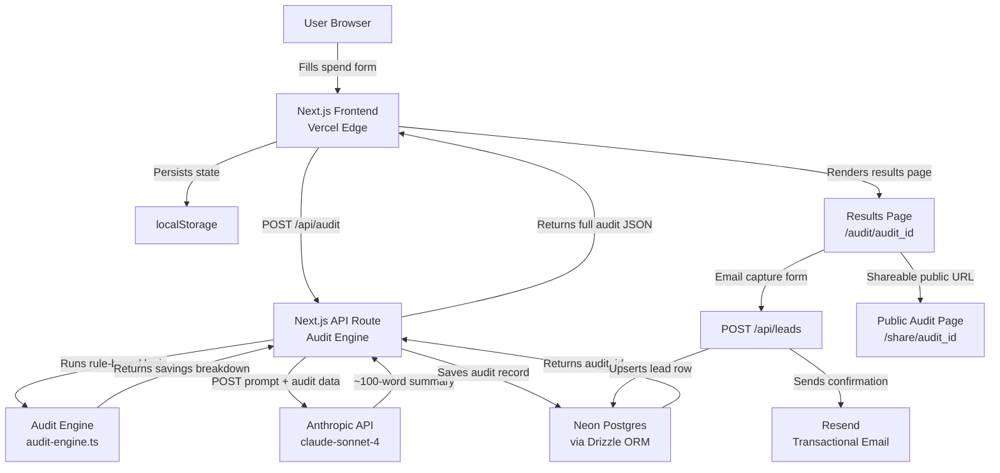

# ARCHITECTURE.md

## System Diagram



---

## Data Flow: Input → Audit Result

```
1. USER INPUT
   └── SpendForm component collects:
       - Tool name, plan, seats, monthly spend
       - Team size, primary use case
       - Persisted to localStorage on every change

2. SUBMIT → POST /api/audit
   └── Request body: { tools: [...], teamSize, useCase }

3. AUDIT ENGINE  (lib/audit-engine.ts)
   └── For each tool:
       a. Look up current plan price from PRICING_DATA constants
       b. Compare user's reported spend vs expected spend for seat count
       c. Run rule set: wrong-plan check → cheaper-plan check → alt-tool check
       d. Produce per-tool recommendation + savings delta
   └── Aggregate: totalMonthlySavings, totalAnnualSavings
   └── Tag audit: "high-savings" (>$500/mo) | "optimal" (<$100/mo) | "medium"

4. LLM SUMMARY  (lib/summarize.ts)
   └── Build prompt with audit results + use case context
   └── Call Anthropic API (claude-sonnet-4-20250514)
   └── On failure / timeout → fall back to handlebars template summary

5. PERSIST  (lib/db/audits.ts  via Drizzle ORM → Neon Postgres)
   └── Insert row: audits table
       { id (uuid), tools_json, results_json, summary, tag, created_at }
   └── Public share row strips: email, company_name

6. RESPONSE → client
   └── Full audit JSON + audit_id returned
   └── Client navigates to /audit/[audit_id]

7. LEAD CAPTURE  (optional, post-value)
   └── POST /api/leads → upsert leads table { audit_id, email, company, role }
   └── Resend fires transactional email confirmation
```

---

## Why This Stack

### Next.js (App Router)
Server Components let the public share page (`/share/[id]`) render with correct Open Graph meta tags server-side without a separate SSR service. API Routes keep the audit engine and DB calls server-side — no secrets exposed to the client. A single Vercel deployment covers frontend, backend, and edge functions.

### Neon Postgres
Serverless Postgres with connection pooling built-in — no cold-start connection exhaustion that hits traditional Postgres on Render under burst traffic. Drizzle ORM keeps queries type-safe and the schema close to plain SQL, making the audit logic easy to audit (no pun intended) by a finance person reading the code.

### Vercel
Zero-config deploys from `main`, preview URLs per PR, and automatic edge caching for the public share pages. Pairs natively with Next.js — no Dockerfile, no CI deploy step beyond `vercel --prod`.

### Drizzle ORM
Lightweight, TypeScript-first, generates migrations from schema — no "magic" query builder. Every DB interaction is readable as near-SQL, which matters when the audit logic needs to be defensible.

### Resend
Simple REST API for transactional email, generous free tier (3,000 emails/month), and React Email for templating — consistent with the Next.js/React stack.

### Anthropic API (claude-sonnet-4)
Used only for the personalised summary — not the audit math. The audit engine is deterministic rule-based logic; AI is reserved for the one place where natural language synthesis adds real value.

---

## What I'd Change at 10k Audits/Day

**~7 audits/minute sustained, with spike bursts at Product Hunt / HN traffic.**

| Problem at scale | Change |
|---|---|
| Anthropic API latency (~2–4s) blocks the response | Move summary generation to a background job (Inngest or Vercel Queue). Return audit result immediately; poll or stream the summary separately. |
| Neon connection pool saturation | Switch from direct connections to PgBouncer pooler endpoint (Neon provides this). Consider read replica for the public `/share` pages. |
| Cold-start latency on API routes | Move the audit engine to a Vercel Edge Function — it's pure computation with no DB call until persist step. |
| Pricing data hardcoded in source | Extract `PRICING_DATA` into a Neon table with a simple admin UI. Allows pricing updates without a redeploy. Add a `verified_at` timestamp; alert if any entry is >30 days stale. |
| Single-region DB | Enable Neon's branching + global read replicas. Share pages are read-heavy and globally distributed. |
| Abuse / spam leads | Move from honeypot-only to hCaptcha on the email capture form, and add per-IP rate limiting via Vercel's `@vercel/kv` (Redis). |
| Observability | Add Sentry for error tracking and PostHog for funnel analytics (form start → audit viewed → email captured → share link clicked). |