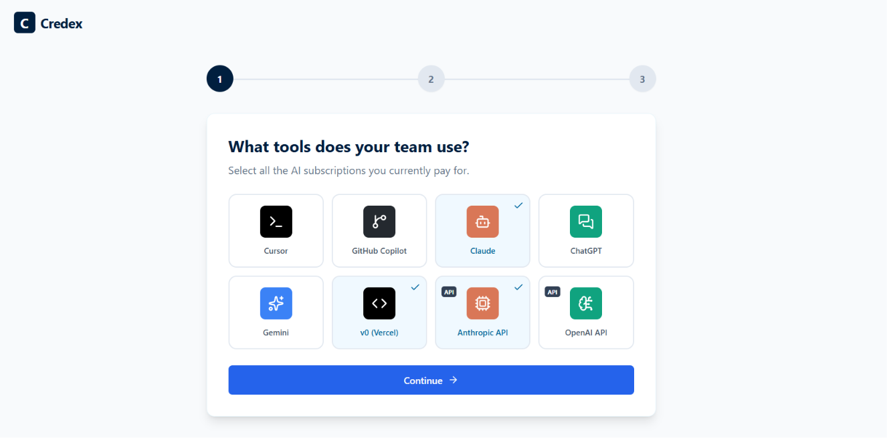
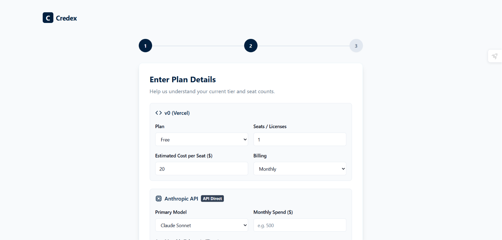
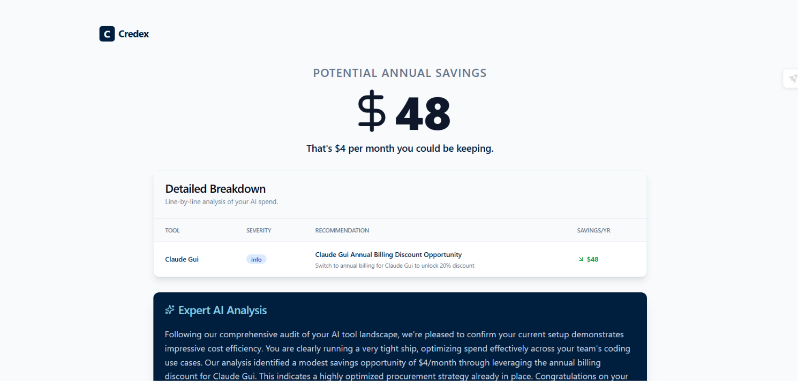

# Credex AI Spend Auditor

**Free AI spend audit for startups.** Input your AI tool stack, get an instant breakdown of where you're overspending, what to switch, and your total monthly + annual savings — with a shareable link.

Built as part of the Credex Round 1 assignment. The tool is a lead-generation asset for Credex's discounted AI credits business: audits surface real overspend, and Credex is the solution for high-savings users.

🔗 **Live URL:** https://credex.jitendraky.tech/

---

## Screenshots

**Home Page**


**Spend Input Form — AI Tool Selector**


**Multi-Step Spend Form**


**Audit Results Report**


**Open Graph Share Preview**


---

## Quick Start

### Prerequisites

- Node.js 20+
- A Neon Postgres database (free tier works)
- A Google Gemini API key (free tier works)

### Install & Run Locally

```bash
git clone https://github.com/jitendra-ky/credex.git
cd credex
npm install

# Copy and fill in environment variables
cp .env.example .env
# Edit .env: set DATABASE_URL and GEMINI_API_KEY

# Run database migrations
npm run db:push

# Start development server
npm run dev
```

Visit [http://localhost:3000](http://localhost:3000)

### Run Tests

```bash
npm test                  # All tests
npm run test:coverage     # With coverage report
npm run lint              # ESLint
npm run type-check        # TypeScript
```

### Deploy to Vercel

```bash
npm install -g vercel
vercel --prod
```

Set these environment variables in Vercel dashboard:
- `DATABASE_URL` — Neon Postgres connection string
- `GEMINI_API_KEY` — Google Gemini API key
- `NEXT_PUBLIC_APP_URL` — Your Vercel deployment URL

---

## Decisions

### 1. Rule-based audit engine over LLM-based audit engine

The audit math is deterministic rule-based logic, not AI. Each rule maps to a specific overspend pattern (wrong plan for seat count, SCIM tax, billing cycle arbitrage, etc.) with explicit, citable pricing numbers. A finance person should read each finding and immediately agree with the reasoning. Using LLM for this would introduce hallucinated numbers and non-defensible recommendations — exactly the wrong behaviour for a financial tool. AI is reserved for the one place it adds genuine value: synthesising findings into a readable ~100-word summary.

### 2. Gemini 2.5 Flash instead of Anthropic claude-sonnet-4

The assignment preferred Anthropic API, but Gemini 2.5 Flash has a generous free tier (no billing setup required), extremely low latency, and produces quality output for the constrained ~100-word summary task. The prompt template is identical regardless of which LLM is used; the service is easily swappable. Documented the API key setup in `.env.example`.

### 3. Neon Postgres + Drizzle ORM over Supabase or Firebase

Neon is serverless Postgres with connection pooling built-in — no cold-start connection exhaustion under burst traffic. Drizzle ORM is TypeScript-first with near-SQL readability, which matters when the audit logic needs to be auditable. Supabase adds a client SDK abstraction that obscures what queries actually run; Drizzle keeps every DB call explicit.

### 4. Share flow: `is_shared` boolean flag, not share codes

An early implementation generated unique share codes (8-char random strings) with a separate lookup route. Removed in favour of a simple `is_shared` boolean on the audit row — the UUID already serves as the unique, unguessable public identifier. Less code, one fewer query, and easier to reason about. Documented in commit `7440991`.

### 5. Honeypot abuse protection over hCaptcha for lead capture

hCaptcha adds a visual challenge that increases friction and hurts conversion — bad economics for a lead-gen tool where the primary goal is capturing emails. A honeypot field (hidden `website` field that bots fill in) catches the majority of automated submissions with zero UX impact. Documented in `ARCHITECTURE.md` under "What I'd change at 10k audits/day."

---

## Project Structure

```
src/
├── app/                    # Next.js App Router (pages + API routes)
│   ├── api/audit/          # POST /api/audit — runs engine, saves to DB
│   ├── api/leads/          # POST /api/leads — lead capture
│   ├── api/og/             # GET /api/og — dynamic Open Graph image
│   ├── audit/[id]/         # Audit results page
│   └── share/[id]/         # Public shareable audit page
├── features/
│   ├── audit/              # Audit engine, rules, services, tests
│   │   ├── engine/         # AuditRuleEngine orchestrator
│   │   ├── rules/          # TypeI–V defect rules (12 rules total)
│   │   ├── services/       # AuditService, SummaryGenerationService
│   │   └── __tests__/      # 8 test files, 60+ test cases
│   └── leads/              # Lead capture services and types
├── lib/
│   ├── db/                 # Drizzle schema + queries
│   ├── api/                # Error classes, response helpers
│   └── validators/         # Zod schemas
├── components/             # Shared UI components (Button, Card, Input)
└── types/                  # Global TypeScript types
```

---

## Tech Stack

| Layer | Choice | Why |
|---|---|---|
| Framework | Next.js 14 (App Router) | Server components for OG tags, API routes, single Vercel deploy |
| Language | TypeScript (strict) | Type-safe audit logic, Zod validation |
| Database | Neon Postgres + Drizzle ORM | Serverless, connection-pool safe, near-SQL readability |
| AI | Google Gemini 2.5 Flash | Free tier, low latency, swappable |
| Email | Resend (configured, free tier) | Simple REST API, React Email templates |
| Styling | Tailwind CSS v3 | Rapid UI, consistent design tokens |
| Testing | Jest + React Testing Library | 60+ tests, CI-green |
| Deploy | Vercel | Zero-config, preview URLs, native Next.js |