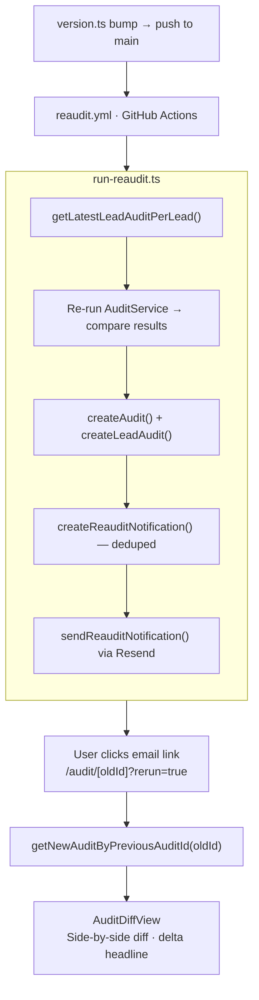

> [!IMPORTANT]
> **Note for reviewers:** The re-audit pipeline is triggered by pushing to `main`, which requires write access to this repo. If you don't have it, here's an alternative: submit an audit on the live site and complete the OTP verification so you're registered as a lead — then let me know. I'll change a pricing rule and trigger the re-audit script on my end. You'll receive the notification email directly in your inbox and can click through to the diff view to verify the full end-to-end flow yourself. I mentioned in the `ROUND2_DEVLOG.md` why I use this method.

## What this PR does

Adds a full "re-audit on pricing change" system on top of the Round 1 audit tool. Every lead who submits their AI stack is now tracked in the database across engine versions. When the audit rule engine is updated (pricing changes, new plans, revised logic), the system automatically detects every lead whose result would change, re-runs their audit, persists the new result, and sends them a single consolidated notification email with a one-click link to view an interactive diff of old vs. new recommendations.

## Why

AI tool pricing is not static — Cursor restructured its plans in 2024, Claude introduced Max tiers in 2025, Copilot added Pro+. A one-time audit that goes stale is worse than no audit at all: it gives users false confidence. The core assumption is that a user who cares enough to audit their stack once will want to know when their savings opportunity has changed. This feature closes that loop automatically and turns a one-shot utility into a living recommendation engine.

## How it works

**Trigger:** Updating `src/features/audit/engine/version.ts` (bumping `AUDIT_ENGINE_VERSION`) on `main` triggers a GitHub Actions workflow (`.github/workflows/reaudit.yml`).

**Pipeline** (`scripts/run-reaudit.ts`):
1. Queries `lead_audits` for every lead whose latest row has an engine version older than `AUDIT_ENGINE_VERSION`
2. Re-runs `AuditService.executeAudit(tools_json)` in-memory with the new rule engine
3. Compares `total_monthly_savings_usd` and `audit_tag` — skips if unchanged
4. If changed: inserts a new `audits` row + new `lead_audits` row (with `previous_audit_id` pointing to the old audit) + marks the old row `is_stale=true`
5. Inserts a `reaudit_notifications` row (unique on `lead_id + engine_version` — no duplicates)
6. Sends one email per affected lead via Resend

**Diff view** (`/audit/[oldAuditId]?rerun=true`):  
The email link hits the existing `/audit/[id]` page with `?rerun=true`. The server uses `previous_audit_id` to look up the new audit, then renders `AuditDiffView` — a side-by-side table with color-coded rows (amber=changed, green=new, red=removed, muted=unchanged), a savings delta headline, and collapsed unchanged rows.

**Data flow diagram:**



**New DB tables:**
- `lead_audits` — one-to-many between leads and audits, tracks `engine_version`, `is_stale`, `previous_audit_id`
- `reaudit_notifications` — dedup guard, one row per lead per engine version
- `email_verifications` — OTP verification during lead capture (also Round 2)

## What I cut

- **Pricing snapshot column on `audits` table.** The spec asks for a `pricing_snapshot` field. I deliberately chose not to add it because pricing in this system is not external data — it's baked into the audit rule code (`src/features/audit/rules/`). The "pricing snapshot" is effectively the engine version + tools_json together. Adding a JSON snapshot of the pricing constants would duplicate information already recoverable from the git history of the rule files at that version. Documented clearly so reviewers can disagree.

- **One-click unsubscribe from email.** The bonus feature. I prioritized the diff view (harder, higher value, more novel) over the unsubscribe link (simpler but lower user impact in a 36h window). Next thing I'd add.

- **Admin dashboard** (total audits, emails sent, click-through %). The `reaudit_notifications` table has all the data needed to build this. Not built — no time.

- **"What changed in the AI tooling market this week" public page.** Would be a compelling growth surface but requires accumulated pricing-change data over time. The infrastructure (version bumps + detection) is there; the display layer is not.

- **HTTP endpoint for triggering re-audits.** The spec example shows `POST /api/detect-changes`. I chose GitHub Actions + a standalone script instead, because it avoids exposing a privileged endpoint on the production server and removes the need for a secret token just to call our own server. The trade-off is that a reviewer can't `curl` it — see testing instructions below.

## How to test it manually

**Option A — Full end-to-end via engine version bump (recommended):**

1. Submit an audit on the live site with any AI stack
2. Complete the OTP email verification to register as a lead
3. In the repo, open `src/features/audit/rules/` and change any pricing constant (e.g. bump a monthly price), then bump `AUDIT_ENGINE_VERSION` in `src/features/audit/engine/version.ts` from `1.0.0` to `1.0.1` and also change something in auditEngine for example -> (src\features\audit\engine\AuditRuleEngine.ts -> line 69)
4. Commit and push to `main`
5. GitHub Actions triggers `reaudit.yml` → runs `scripts/run-reaudit.ts` with `DATABASE_URL`, `RESEND_API_KEY`, `EMAIL_PROVIDER=resend`, `NEXT_PUBLIC_BASE_URL` from repo secrets
6. Check the email inbox used during lead capture — you'll receive a re-audit notification email listing what changed and containing a re-run link
7. Click the link → `https://credex.rocks/audit/[oldAuditId]?rerun=true` → diff view loads

```

This runs the full pipeline directly. Useful for testing without a push.

## What's tested

- `src/app/api/audit/route.test.ts` — audit creation API, including DB persistence
- `src/features/leads/services/__tests__/` — OTP service state machine (send cooldown, attempt lockout, expiry), email verification flow
- `src/features/audit/__tests__/` — audit engine rule evaluation, savings calculations

**If I had more time, I'd test:**
- `run-reaudit.ts` pipeline with a mock DB (verify stale detection, dedup, email send)
- `getLatestLeadAuditPerLead()` query with multiple engine versions in test fixtures
- `AuditDiffView` rendering with snapshot tests for each row status (changed/new/removed/unchanged)
